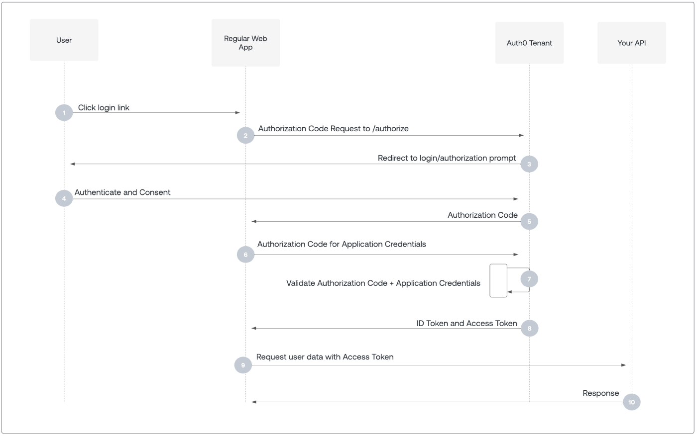

# Polybrain Server

Server for Polybrain's website and chrome plugin.

## Running

Install just:

```sh
cargo install just
```

You can start and stop the server with:

```sh
just start # start the server
just stop # stop the server
```

The server logs will store in `server.log`.

## Authentication

Polybrain uses [Auth0](https://auth0.com/) to manage authentication. This means that all the heavy
lifting to ensure that user credentials are kept safely secured.

The following describes the workflow to authenticate with Auth0



Upon account creation, Auth0 stores a user in their own database. Auth0 offers a separate set of API calls to interface their management API—which allows Polybrain to use Auth0 for the entire user management process.

Auth0 related endpoints are defined in [src/auth/endpoints.rs](src/auth/endpoints.rs).

## API Key Security

It is paramount importance to protect the user's OnShape and OpenAI API keys. All API keys are stored encrypted in MongoDB using [AES128](https://en.wikipedia.org/wiki/Advanced_Encryption_Standard) encryption:


AES128 is an industry standard for encryption; even if a hacker could breach the MongoDB database, they would effectively be stealing garbage. Still, the database is IP-address restricted, meaning only a few (2) whitelisted IP addresses can connect to the database.

### Server Security

The machine that runs Polybrain Server disables password authentication and runs [fail2ban](https://github.com/fail2ban/fail2ban), which has been trusted for 19 years to help crack down on malicious login attempts.

There is also an alarm system that instantly notifies the admin of each login.

## Contributing

This repo should be little maintenance; the bulk of the changes will be to the polybrain-core repo, where the actual polybrain logic is executed.

There are no strict guidelines for contributing to this project. All contributions are welcomed.

If you believe you have discovered a security vulnerability, do not hesitate to contact [kyletennison05@gmail.com](mailto:kyletennison05@gmail.com).
